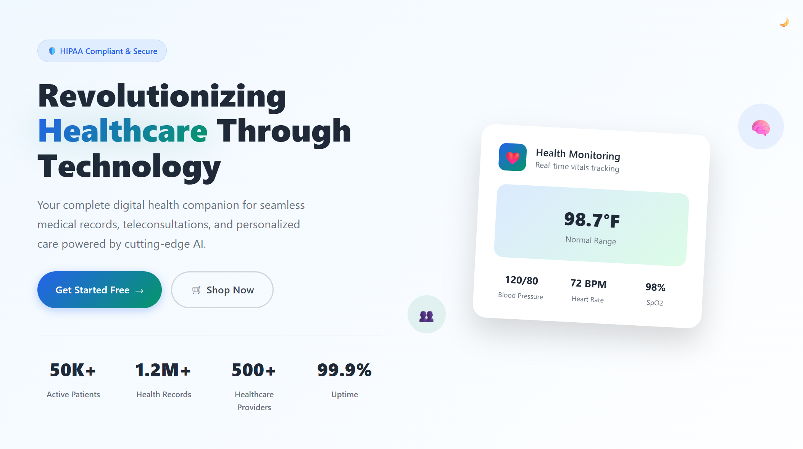

# 🌐 MediVerse – The Future of Digital Healthcare

[](https://medixpert.netlify.app/)
[](LICENSE)

MediVerse is an AI-powered, role-based telemedicine platform built by **Ankur Gupta** and **Abhyuday Pratap Singh** to revolutionize healthcare with:

## 🏠 Home Page




✅ **Video Consultations (WebRTC):** Secure, real-time video calls between patients and doctors.  
🧠 **AI Predictions:** Instant health insights before consultation.  
🎙 **ElevenLabs Voice Assistant:** Interact hands-free with our AI voice bot.  
📄 **Document Upload & Analysis:** Upload prescriptions/reports and get insights directly in chat.  
🔐 **Role-Based Access:** Tailored, secure features for patients and doctors.  
🛒 **Shop Now:** Buy medical products directly within the app.

---

## 🚀 Features

- **WebRTC Video Calls** – High-quality, encrypted consultations.
- **AI Predictions** – Early diagnosis assistance.
- **Document Analysis** – Automated parsing and interpretation.
- **Voice Integration** – Conversational interface with ElevenLabs AI.
- **High Security** – Encrypted document storage and streaming.
- **User Roles** – Different dashboards & features for doctors and patients.
- **Shop Now** – Integrated e-commerce for medical essentials.

---

## 📸 Demo

A detailed video demo will be shared soon. Stay tuned!

---

## 📚 User Guide

A full user manual PDF is available [here](https://drive.google.com/file/d/1tJwRuEg9FRfy-7qHhuxK0rZHVc4GfEHd/view?usp=sharing) to help new users get started.

---

## 🔗 Live Application

You can try MediVerse here: [APP_LINK](https://medixpert.netlify.app/)

---

## 🛠️ Technologies Used

- Frontend: React.js
- Backend: Node.js + Express
- Database: MongoDB
- Real-Time: WebRTC, Socket.io
- AI: Custom prediction models, ElevenLabs API
- Hosting: AWS 
- Security: JWT, HTTPS, role-based access

---

## 📂 Installation

```bash
# Clone the repo
git clone https://github.com/YOUR_GITHUB_USERNAME/MediVerse.git
cd MediVerse

# Start the frontend
cd client
npm install
npm run dev

# In a new terminal, start the backend
cd server
npm install
npm run dev

#  Python-based service, run it with:
python -m server.app

