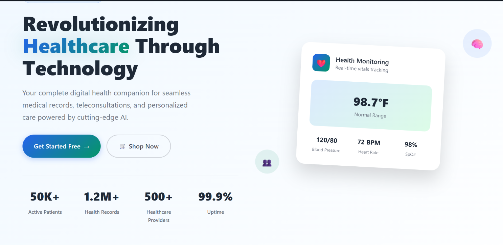

# 🌐 MediVerse – The Future of Digital Healthcare

MediVerse is an AI-powered, role-based telemedicine platform built by **Ankur Gupta** and  
**Abhyuday Pratap Singh** to revolutionize digital healthcare with smart automation and  
real-time remote consultations.

---

## 🏠 Home Page  


MediVerse offers a clean, modern, intuitive interface packed with powerful capabilities:

- 🎥 **WebRTC-based video consultations**
- 🧠 **AI-driven health predictions**
- 🎙 **Voice-enabled assistant (ElevenLabs AI)**
- 📄 **Smart document extraction & analysis**
- 🔐 **Role-based dashboards for patients & doctors**
- 🛒 **Built-in medical store module**

---

## 🚀 Features

### 👨‍⚕️ WebRTC Video Calls  
High-quality, secure, encrypted doctor–patient video consultations.

### 🧠 AI Predictions  
Predict early signs of health risks using machine learning models.

### 📄 Document Analysis  
Upload lab reports, prescriptions, or PDFs — get insights instantly.

### 🎙 Voice Interaction  
Hands-free conversational assistant powered by ElevenLabs Voice API.

### 🔐 Secure Role-Based System  
Each user gets customized access and a personalized dashboard.

### 🛒 ShopNow Module  
Integrated medical e-commerce experience built into the application.

---

## 🎥 Demo  
A full showcase video will be uploaded soon. Stay tuned!

---

## 📚 User Guide  
A detailed onboarding manual is available:  
👉 **[Click here for the User Guide (PDF)](https://drive.google.com/file/d/1tJwRuEg9FRfy-7qHhuxK0rZHVc4GfEHd/view)**

---

## 🔗 Live Application  
Try MediVerse here:  
👉 **https://medixpert.netlify.app/**

---

## 🛠️ Technologies Used

### **Frontend**
- React.js  
- Vite  
- HTML / CSS  

### **Backend**
- Node.js  
- Express.js  
- MongoDB  

### **Real-Time Communication**
- WebRTC  
- Socket.io  

### **AI & Automation**
- Python-based health prediction models  
- ElevenLabs Voice API  

### **Cloud & Hosting**
- AWS  
- Netlify  
- Cloud-based secure uploads  

### **Security**
- JWT Authentication  
- HTTPS  
- Role-based access control (RBAC)

---

## 📦 Installation

```bash
# Clone the repository
git clone https://github.com/Abhii9180/HealthVerse_Milestone_WEBRTC_ABHYUDAY.git
cd MediVerse

# -------------------------------
# Frontend Setup
# -------------------------------
cd client
npm install
npm run dev

# -------------------------------
# Backend Setup
# -------------------------------
cd ../server
npm install
npm run dev

# -------------------------------
# Python AI Service
# -------------------------------
python -m server.app

```


```
📂 Project Structure (High Level)
MediVerse/
│── client/                # React frontend
│── server/                # Node.js backend
│── flask_ai/              # Python ML services
│── RazorPay/              # Payment gateway module
│── React-webRTC-main/     # WebRTC video call module
│── assets/                # README images
│── README.md
│── package.json
```


👨‍💻 Contributors

Abhyuday Pratap Singh

Ankur Gupta
